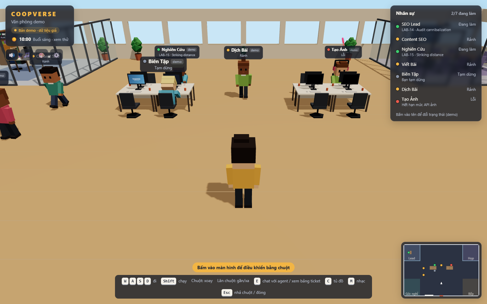
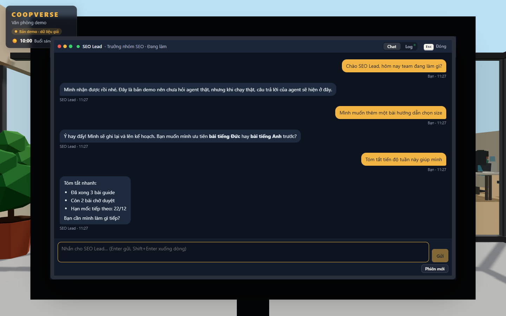
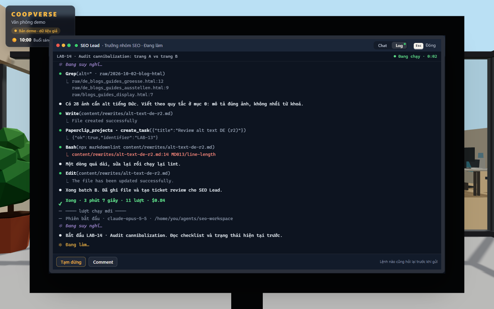
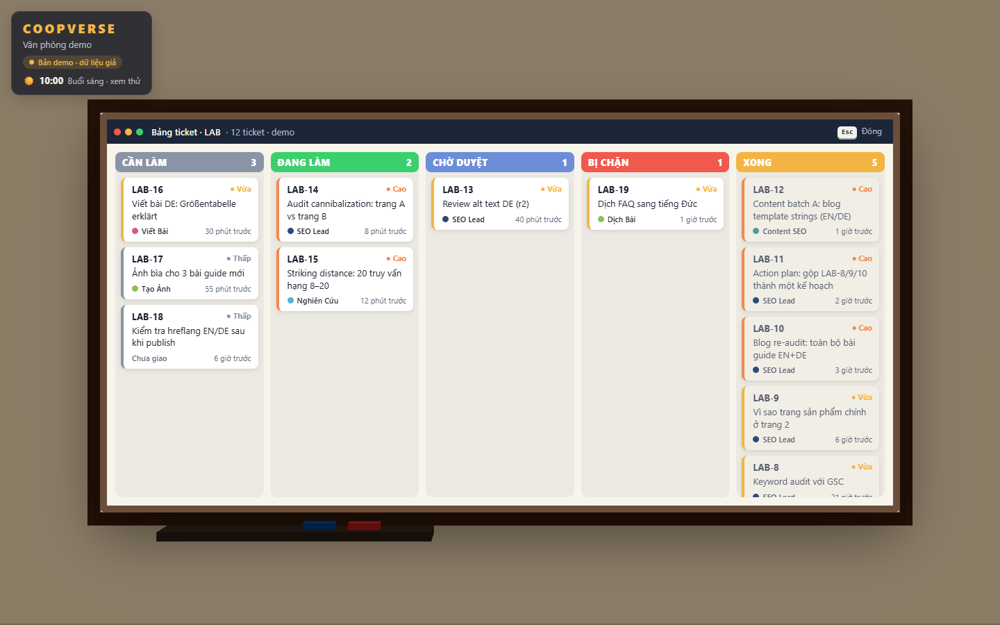
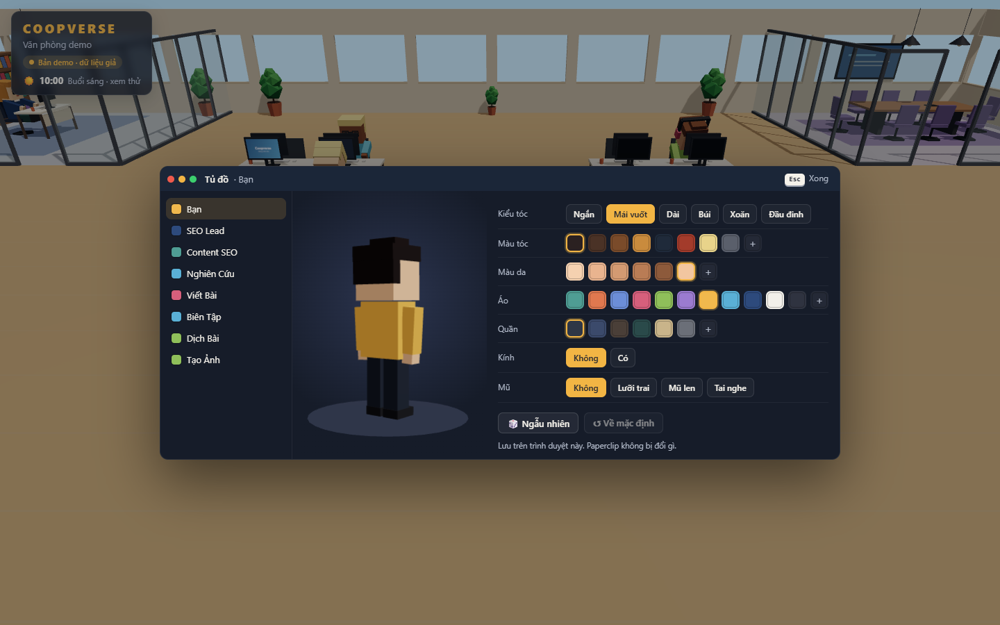
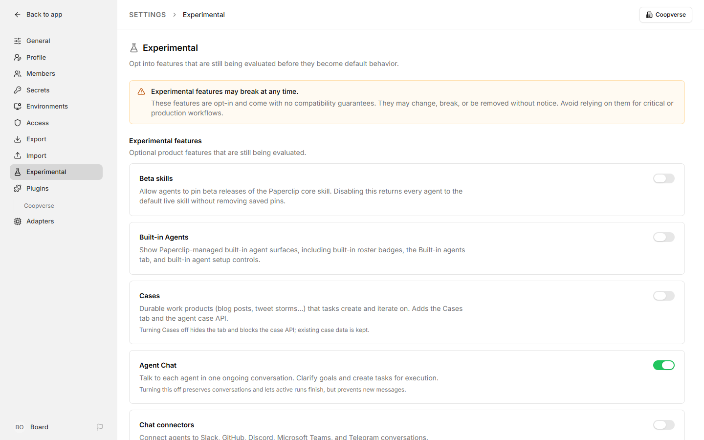
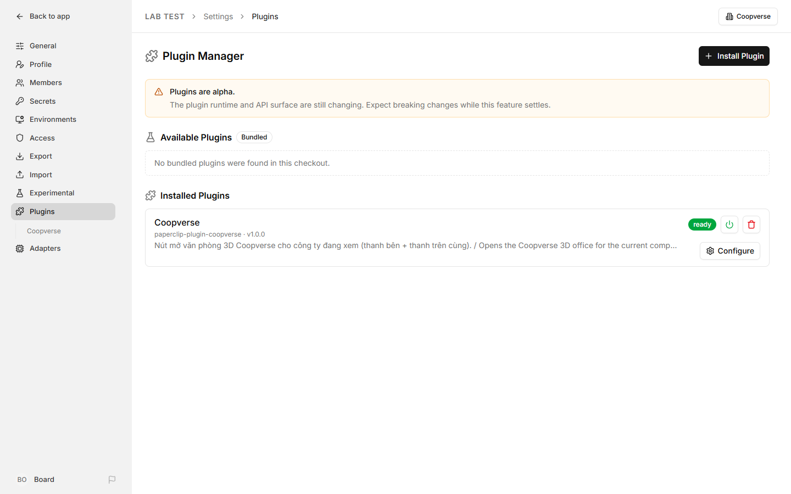
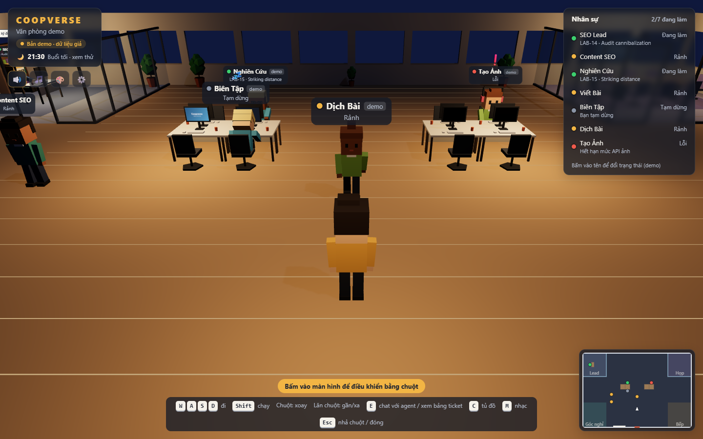

# Coopverse

**Văn phòng 3D kiểu game cho các agent AI chạy trên [Paperclip](https://github.com/paperclipai/paperclip).**
Bạn đi lại trong văn phòng, thấy agent ngồi gõ phím khi đang làm việc, đi pha cà phê khi rảnh, ôm đầu khi lỗi. Đến bàn agent bấm **E** để chat bằng tiếng Việt hoặc xem màn hình CLI của nó chạy trực tiếp.

[English](README.en.md)

> **Đây là nhánh `pixel`: bản 2D pixel kiểu Stardew Valley**, vẽ bằng PixiJS và gói hình pixel của [LimeZu](https://limezu.itch.io).
> Văn phòng, agent, chat, CLI, bảng ticket, EXP… giống bản 3D ở nhánh `main`, chỉ khác phần hình.
> Gói hình có bản quyền nên **không nằm trong repo**: muốn chạy nhánh này bạn cần tự mua 2 gói của LimeZu (xem [bước 4](#4-cài-coopverse)).
> Ảnh chụp trong README này là bản 3D.



- **Agent thật, cập nhật tức thì**: đọc agent, ticket, lượt chạy từ Paperclip qua WebSocket. Mỗi công ty trên Paperclip là một văn phòng riêng.
- **Chat với từng agent** (Agent Chat của Paperclip) ngay tại bàn của nó.
- **Xem CLI trực tiếp**: log lượt chạy hiện như Claude Code. Có nút Đánh thức / Tạm dừng / Tiếp tục / Comment, nút nào cũng hỏi xác nhận trước.
- **Bảng ticket kanban** trên tường, tủ đồ đổi ngoại hình, ngày/đêm theo giờ Việt Nam, nhạc lofi tự sinh.
- **Nút "Coopverse" ngay trong Paperclip** (plugin kèm theo): bấm là mở văn phòng của công ty đang xem.
- Toàn bộ hình khối và âm thanh dựng bằng code, không tải asset nào.

| Chat với agent | Màn hình CLI của agent |
|---|---|
|  |  |
| **Bảng ticket** | **Tủ đồ** |
|  |  |

---

## Mục lục

1. [Cần chuẩn bị](#1-cần-chuẩn-bị)
2. [Cài Paperclip](#2-cài-paperclip)
3. [Tạo công ty, agent và bật Agent Chat](#3-tạo-công-ty-agent-và-bật-agent-chat)
4. [Cài Coopverse](#4-cài-coopverse)
5. [Cài nút Coopverse vào Paperclip](#5-cài-nút-coopverse-vào-paperclip)
6. [Cách dùng](#6-cách-dùng)
7. [Cấu hình](#7-cấu-hình)
8. [Xử lý sự cố](#8-xử-lý-sự-cố)
9. [Bảo mật](#9-bảo-mật)
10. [Dành cho người phát triển](#10-dành-cho-người-phát-triển)

---

## 1. Cần chuẩn bị

| Cần gì | Ghi chú |
|---|---|
| **Node.js 24.11 trở lên** | Paperclip yêu cầu bản này. Coopverse chạy được với Node 22.12+. Tải ở [nodejs.org](https://nodejs.org). |
| **Git** | Để tải mã nguồn. |
| **Chrome hoặc Edge** | Cần WebGL (PixiJS). |
| **Gói hình LimeZu** | Modern Interiors và Modern Office, mua trên itch.io. Xem [bước 4](#4-cài-coopverse). |
| **Tài khoản cho agent** | Agent của Paperclip chạy bằng Claude Code, Codex, Gemini… Ví dụ với Claude Code: cài `claude` và đăng nhập trước. |
| **Windows** | Nên chạy Paperclip trong **WSL2** (Ubuntu), còn Coopverse chạy trên Windows. Đây là cách đã thử kỹ nhất. |

Coopverse đã thử với Paperclip **2026.916.1**.

## 2. Cài Paperclip

Chạy trong terminal (Windows thì chạy trong WSL):

```bash
npx paperclipai@latest onboard --yes
```

Lệnh này tạo cấu hình, cơ sở dữ liệu (PostgreSQL nhúng, không phải cài gì thêm) và bật Paperclip ở **http://localhost:3100**. Mở địa chỉ đó trong trình duyệt để kiểm tra.

Muốn có lệnh `paperclipai` dùng lâu dài (khuyên dùng):

```bash
npx paperclipai@latest install --yes
```

Từ lần sau, bật Paperclip bằng:

```bash
paperclipai run
```

> Xem thêm hướng dẫn gốc của Paperclip: <https://github.com/paperclipai/paperclip>

## 3. Tạo công ty, agent và bật Agent Chat

1. Mở http://localhost:3100. Lần đầu Paperclip hướng dẫn tạo **công ty** đầu tiên.
2. Vào **Agents** để thêm agent (tên, vai trò, adapter như Claude Code).
   - Coopverse xếp chỗ ngồi theo sơ đồ tổ chức. Agent nào có người **báo cáo cho mình** (trường *Reports to*) là **Lead**, ngồi phòng kính. Các agent còn lại ngồi open space theo nhóm của Lead.
   - Mỗi văn phòng có tối đa 26 bàn (2 Lead và 24 thành viên).
3. **Bật Agent Chat** để chat được trong Coopverse: **Settings → Experimental → Agent Chat** (bật công tắc). Tính năng này bật cho cả Paperclip, không phải bật riêng từng công ty.



## 4. Cài Coopverse

Chạy trên máy bạn dùng trình duyệt (Windows: chạy trong PowerShell hoặc Git Bash, **không** chạy trong WSL):

```bash
git clone -b pixel https://github.com/minhle2112/coopverse.git coopverse-pixel
cd coopverse-pixel
npm install
```

**Đặt gói hình pixel (bắt buộc với nhánh này).** Bản pixel dùng 2 gói của LimeZu, bản 16×16:

- **Modern Interiors**: <https://limezu.itch.io/moderninteriors>
- **Modern Office**: <https://limezu.itch.io/modernoffice>

Mua và tải về, rồi giải nén như sau (mặc định Coopverse tìm ở thư mục `coopverse-assets/limezu` nằm **cạnh** thư mục dự án):

```
coopverse-assets/limezu/
  1_Interiors/ 2_Characters/ 4_User_Interface_Elements/ …   ← nội dung gói Modern Interiors
  Modern_Office/
    Modern_Office_16x16.png …                                 ← nội dung gói Modern Office
```

Để chỗ khác thì đặt `COOPVERSE_ASSETS=<đường dẫn tới thư mục limezu>` trong file `.env`. Thiếu gói nào thì văn phòng hiện thông báo "Chưa có gói hình pixel" kèm hướng dẫn.
Hình chỉ được phục vụ cho chính máy bạn (`127.0.0.1`) khi chạy Coopverse. Đừng commit hay chia sẻ lại các file hình: giấy phép của LimeZu không cho phát tán lại.

Rồi chạy:

```bash
npm run dev
```

Mở **http://127.0.0.1:5179** (bản 3D dùng cổng 5177, nên hai bản chạy song song được). Coopverse tự tìm Paperclip ở `127.0.0.1:3100` và mở công ty đầu tiên.

**Trên Windows** có sẵn `start-coopverse.cmd`, chỉ cần bấm đúp. Script này:

1. Kiểm tra Paperclip đã chạy chưa.
2. Chưa chạy thì tự bật trong một cửa sổ thu nhỏ tên "Paperclip". Có hai cách:
   - Paperclip trong WSL: thêm `PAPERCLIP_WSL_DISTRO=Ubuntu` (tên bản WSL của bạn, xem bằng `wsl -l`) vào file `.env`.
   - Paperclip cài thẳng trên Windows: script tự dùng lệnh `paperclipai` nếu tìm thấy.
3. Cài thư viện lần đầu, bật Coopverse và mở trình duyệt.

Muốn xem thử trước khi có Paperclip: mở **http://127.0.0.1:5179/?demo** để dùng dữ liệu giả.

## 5. Cài nút Coopverse vào Paperclip

Thư mục [`paperclip-plugin/`](paperclip-plugin) là một plugin Paperclip. Nó thêm mục **Coopverse ↗** vào thanh bên trái và nút **Coopverse** ở góc trên phải mọi trang. Bấm vào là mở Coopverse đúng công ty bạn đang xem, luôn dùng chung một tab.


Plugin đã được build sẵn trong `paperclip-plugin/dist`, không cần build lại. Chạy lệnh cài **trên máy đang chạy Paperclip**:

```bash
paperclipai plugin install --local /đường/dẫn/tới/coopverse/paperclip-plugin
```

(Chưa có lệnh `paperclipai` thì thay bằng `npx paperclipai@latest plugin install --local …`.)

Đường dẫn phải là đường dẫn mà Paperclip thấy được:

- **Linux / macOS**: ví dụ `~/coopverse/paperclip-plugin`.
- **Windows + WSL**: ổ C nằm ở `/mnt/c/`, ví dụ `/mnt/c/Users/ban/coopverse/paperclip-plugin`. Nếu WSL đã tắt truy cập ổ Windows, chép thư mục vào trong WSL trước rồi cài từ đó:

  ```bash
  mkdir -p ~/paperclip-plugins
  cp -r /mnt/c/Users/ban/coopverse/paperclip-plugin ~/paperclip-plugins/coopverse
  paperclipai plugin install --local ~/paperclip-plugins/coopverse
  ```

Cài xong, tải lại trang Paperclip là thấy nút. Kiểm tra trong **Settings → Plugins**: dòng Coopverse phải có chữ `ready`.



**Bản pixel chạy ở cổng 5179**, còn nút trong Paperclip mặc định mở `http://127.0.0.1:5177` (bản 3D). Muốn nút mở bản pixel, hoặc Coopverse chạy ở địa chỉ khác: vào **Settings → Plugins → Coopverse → Configure**, sửa **Coopverse URL** rồi bấm **Save Configuration**.


Các lệnh khác:

```bash
paperclipai plugin list                          # xem plugin đã cài
paperclipai plugin disable coopverse.launcher    # tạm ẩn nút
paperclipai plugin enable coopverse.launcher     # bật lại
paperclipai plugin uninstall coopverse.launcher  # gỡ hẳn
```

Cập nhật plugin sau khi `git pull`: gỡ (`uninstall`) rồi cài lại bằng lệnh `install` ở trên.

## 6. Cách dùng

### Điều khiển

| Phím | Việc |
|---|---|
| W A S D / mũi tên | Đi |
| Shift | Chạy |
| Cài đặt ⚙️ → Thu phóng | Hai mức: **Gần** (mặc định) và **Xa nhất**. Trình duyệt nhớ mức bạn chọn |
| Rê chuột lên một agent | Hiện thẻ đầy đủ: tên, cấp, danh hiệu, việc đang làm (không cần đi lại gần) |
| **Bấm chuột** | Bấm vào agent: mở màn hình của agent (CLI). Bấm ứng viên ở sảnh: xem phiếu thuê. Bấm bảng ticket / bảng vàng: xem bảng to. Bấm vào chính bạn: tủ đồ. Không cần đi lại gần |
| Bấm tên ở danh sách Nhân sự | Mở màn hình của agent đó (bản demo: chuột phải để đổi trạng thái) |
| **E** | Đứng gần agent: mở màn hình của agent (tab **Chat** và **Log**). Đứng trước bảng ticket: xem bảng to. Bấm lại E để quay ra |
| C | Tủ đồ: đổi ngoại hình của bạn, hoặc của agent đang đứng gần |
| Q | Danh sách việc chờ bạn duyệt / trả lời |
| M | Bật/tắt nhạc lofi |
| Esc | Đóng màn hình đang mở |
| Nút 🔊 🎵 🎨 ⚙️ dưới logo | Âm thanh, nhạc, tủ đồ, cài đặt (âm lượng, xem thử giờ) |

### Chat với agent


- Đến bàn agent, bấm **E**, chọn tab **Chat**. Gõ tiếng Việt rồi **Enter** (Shift+Enter để xuống dòng).
- **Mỗi tin nhắn đánh thức agent chạy một lượt để trả lời**: mất khoảng 20 giây đến vài phút và tốn hạn mức của agent (ví dụ hạn mức Claude). Lần đầu Coopverse hỏi xác nhận.
- Trong lúc agent trả lời, tab **Log** cho thấy nó đang làm gì.
- Gõ `/new` hoặc bấm **Phiên mới** để agent bắt đầu phiên mới, quên ngữ cảnh cũ. Lịch sử chat vẫn giữ.
- Agent gửi câu hỏi hoặc thẻ duyệt kế hoạch thì Coopverse hiện thẻ đó. Phần trả lời thẻ làm trong Paperclip (nút "Trả lời trong Paperclip").
- Bạn đang ở chỗ khác mà agent trả lời xong: có thông báo, và agent nói câu đầu của câu trả lời trong bong bóng.
- Cuộc trò chuyện lưu trong Paperclip, mở trên web Paperclip cũng thấy.

### Màn hình CLI (tab Log)


- Hiện lượt chạy đang chạy, hoặc lượt chạy gần nhất nếu agent rảnh, theo kiểu Claude Code: suy nghĩ, lệnh dùng công cụ, kết quả, lỗi, chi phí.
- Nút theo trạng thái agent: **Đánh thức**, **Tạm dừng**, **Tiếp tục**, **Comment** vào ticket. Lệnh nào cũng có hộp xác nhận.

### Bảng ticket

Bảng kanban treo trên tường. Đứng trước bảng bấm **E** để xem to, bấm vào ticket để mở trong Paperclip.

### Nhiều công ty

Mỗi công ty trên Paperclip là một văn phòng. Có nhiều công ty thì dưới logo Coopverse có ô chọn để đổi. Coopverse nhớ công ty bạn xem lần trước. Mở thẳng một công ty: `http://127.0.0.1:5179/?company=<id công ty>`, đây cũng là cách nút trong Paperclip mở Coopverse.

### Ngày và đêm

Trời sáng tối theo giờ Việt Nam: nắng ban trưa, ánh cam lúc bình minh và hoàng hôn. Ban đêm văn phòng tối xanh, đèn trần, đèn bàn, đèn cây và màn hình hắt sáng. Xem thử giờ khác bằng thanh kéo trong Cài đặt, hoặc thêm `?hour=21.5` vào địa chỉ.



## 7. Cấu hình

Chép `.env.example` thành `.env` rồi sửa (không bắt buộc):

| Biến | Mặc định | Ý nghĩa |
|---|---|---|
| `VITE_PAPERCLIP_URL` | `http://127.0.0.1:3100` | Địa chỉ Paperclip |
| `VITE_COMPANY_ID` | (trống) | Công ty mở mặc định khi chưa chọn lần nào |
| `PAPERCLIP_WSL_DISTRO` | (trống) | Chỉ dùng cho `start-coopverse.cmd`: tên bản WSL đang chạy Paperclip |
| `COOPVERSE_ASSETS` | `../coopverse-assets/limezu` | Thư mục chứa gói hình LimeZu (bản pixel) |

Cài đặt trong app (âm lượng, giờ xem thử…) và ngoại hình nhân vật lưu trên trình duyệt, không đổi gì bên Paperclip.

## 8. Xử lý sự cố

| Hiện tượng | Cách xử lý |
|---|---|
| "Chưa kết nối được Paperclip" | Bật Paperclip (`paperclipai run`) rồi đợi, Coopverse tự kết nối lại. Paperclip ở địa chỉ khác thì sửa `VITE_PAPERCLIP_URL` trong `.env` rồi chạy lại `npm run dev`. |
| Tab Chat báo "Agent Chat đang tắt" | Bật **Settings → Experimental → Agent Chat** trong Paperclip. |
| Gửi tin xong agent không trả lời | Agent có thể đang tạm dừng, lỗi hoặc hết hạn mức. Xem tab Log hoặc trang agent trong Paperclip. |
| Không thấy nút Coopverse trong Paperclip | Tải lại trang. Kiểm tra `paperclipai plugin list` có `coopverse.launcher … ready`. Không có thì xem lại bước 5. |
| Bấm nút Coopverse ra trang lỗi | Coopverse chưa chạy (`npm run dev` hoặc `start-coopverse.cmd`), hoặc **Coopverse URL** trong cấu hình plugin sai. |
| `plugin install` báo "path does not exist" | Đường dẫn không tồn tại trên máy chạy Paperclip. Với WSL, chép thư mục plugin vào trong WSL như hướng dẫn ở bước 5. |
| "Chưa có gói hình pixel" | Gói LimeZu chưa nằm đúng chỗ. Xem [bước 4](#4-cài-coopverse): cần cả `1_Interiors/…` (Modern Interiors) và `Modern_Office/Modern_Office_16x16.png`. Sửa xong thì chạy lại `npm run dev`. |
| Không thấy agent nào | Công ty chưa có agent, hoặc đang xem nhầm công ty. Đổi ở ô chọn dưới logo. |

## 9. Bảo mật

- Coopverse chỉ nghe ở `127.0.0.1`, máy khác trong mạng không mở được.
- Trình duyệt không gọi thẳng Paperclip. Mọi lời gọi đi qua proxy của Coopverse, có **danh sách cho phép** (`vite.config.ts`): chỉ đọc agent, ticket, lượt chạy, log, Agent Chat và vài lệnh (Đánh thức / Tạm dừng / Tiếp tục / Comment / gửi tin chat). Lệnh ghi phải đến từ chính trang Coopverse (kiểm `Origin` và header `x-coopverse`). Endpoint khác bị trả 403.
- Lệnh nào gửi tới agent cũng có hộp xác nhận.
- Plugin chỉ thêm một đường link, không đọc hay ghi dữ liệu nào của Paperclip.

## 10. Dành cho người phát triển

```
src/
  data/        kiểu dữ liệu, adapter Paperclip (paperclip.ts), đồng bộ realtime, chat, đọc + parse log, dữ liệu demo
  pixel/       bản pixel (PixiJS): dựng văn phòng từ gói LimeZu, nhân vật ghép từ Character Generator, bong bóng, ngày/đêm, hiệu ứng lên cấp, tủ đồ
  world/       sơ đồ văn phòng dùng chung, va chạm, bảng giờ/ánh sáng (time.ts); phần 3D cũ vẫn nằm ở đây
  audio/       âm thanh tự tổng hợp: hiệu ứng theo vị trí, nhạc lofi tự sinh (voice.ts: mic/giọng đọc, đang tắt)
  characters/  nhân vật khối chibi + animation
  agents/      hành vi agent bản 3D
  life/        đời sống văn phòng dùng chung: "não" agent (brain.ts: đi, ngồi, né người), lời thoại, chào hỏi, biểu cảm
  player/      di chuyển, camera, điều khiển
  ui/          HUD, minimap, CLI + Chat (Terminal), bảng ticket, tủ đồ, cài đặt
  dev/         hook chỉ dùng khi dev (window.__coop)
server/
  limezu.ts    phục vụ file hình LimeZu từ COOPVERSE_ASSETS ở /limezu/ (chỉ 127.0.0.1)
paperclip-plugin/
  src/         manifest, worker, UI (nút ở thanh bên + thanh trên cùng)
  dist/        bản đã build (commit sẵn)
```

- Stack: Vite, React 19, PixiJS 8, zustand, TypeScript. Chữ pixel: VT323 (OFL, có tiếng Việt).
- Toạ độ từng hình trong gói LimeZu nằm ở `src/pixel/atlas.json` (chỉ toạ độ, không có hình).
- Mọi lời gọi tới Paperclip nằm trong `src/data/paperclip.ts`. Paperclip đổi API thì chỉ sửa ở đó.
- Kiểm tra kiểu và build: `npm run build`.
- Sửa plugin: `cd paperclip-plugin && npm install && npm run build`, rồi cài lại plugin.
- Khi dev có `window.__coop`: `store.getState().openFocus(agentId)` mở màn hình một agent, `inject(...)` bơm sự kiện realtime giả, `settings.getState().set({ hour: 21 })` đổi giờ. Bản pixel có thêm `step(giây)` chạy mô phỏng khi tab bị ẩn, `resume()`, `go(x, z, 'near' | 'far')` dịch tới chỗ khác, `grant(agentId, exp)` thử lên cấp.

## Giấy phép

Mã nguồn: [MIT](LICENSE).

Hình pixel: **LimeZu**, gói [Modern Interiors](https://limezu.itch.io/moderninteriors) và [Modern Office](https://limezu.itch.io/modernoffice). Hình không nằm trong repo và không thuộc giấy phép MIT; mỗi người tự mua gói để dùng. Cảm ơn LimeZu!
